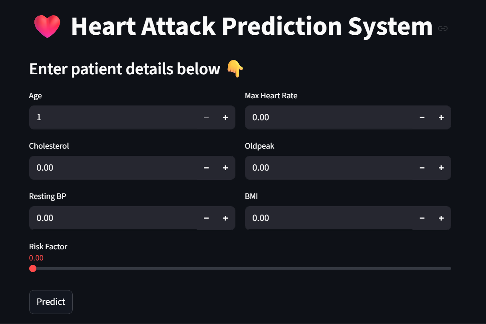
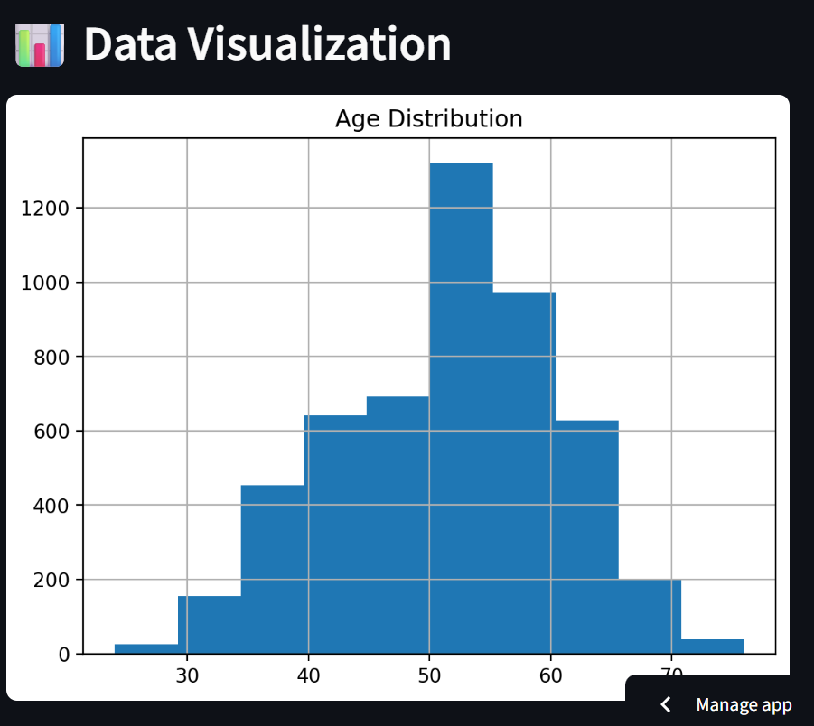

# Heart Attack Prediction System

This project builds a machine learning-based system that predicts the risk of a heart attack for patients based on various health parameters.

The system analyzes factors such as age, sex, cholesterol levels, blood pressure, ECG results, and lifestyle habits to provide a risk assessment.

## Features
- Machine Learning heart attack prediction model
- Data preprocessing and feature engineering
- Interactive dashboard using Streamlit
- Visualizations for patient health insights
- Risk score calculation for personalized recommendations

## Technologies Used
- Python
- Streamlit
- Scikit-learn
- Pandas
- NumPy
- Matplotlib
- Seaborn
- Plotly

## Project Structure
heart-attack-system
│
├── data
│ └── heart_updated.csv
│
├── model
│ └── heart_attack_model.pkl
│
├── src
│ ├── train_model.py
│ ├── preprocess.py
│ ├── predict.py
│
├── app.py
├── requirements.txt
└── README.md

## How to Run the Project

### 1 Install dependencies

### 2 Run the Streamlit app

---

## Live Application

You can access the deployed app here:

https://snez-shanks-heart-attack-system-app-p0ehid.streamlit.app/

---

## 👩‍💻 Author

Sneha Shankarwal  
B.Tech (IT) – Machine Learning & Data Analytics
---
## Future Improvements

• Real-time competitor price scraping  
• Advanced demand forecasting models  
• Integration with e-commerce APIs  
• Automated pricing optimization engine

## Application Preview

### Image 1

### Image 2

